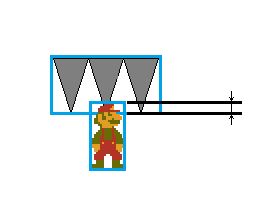
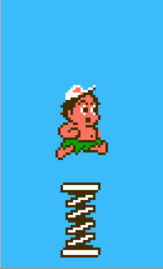

# 碰撞检测

## 重叠

子弹能打死怪物，怪物与玩家相碰使玩家掉血，这些都是通过检测两实体有无重叠部分实现的。

此类游戏都使用AABB检测重叠。AABB中文全称叫轴对齐包装盒。这种方法本质上是检测两实体的包装矩形是否有重叠部分，以此近似检测两实体是否有重叠。维基百科和《游戏引擎架构》都有对它的介绍。

AABB有两种（等价的）实现。

1.

```java
boolean segmentOverlap(int a1, int b1, int a2, int b2) {
	return (b1 >= a2 && a1 < b2);
}

boolean overlap(Rect a, Rect b) {
	return segmentOverlap(a.left, a.right, b.left, b.right) &&
    	segmentOverlap(a.top, a.bottom, b.top, b.bottom);
}
```

2.

```java
boolean overlap(Rect a, Rect b) {
	int aCenterX = (a.left + a.right) / 2, aCenterY = (a.top + a.bottom) / 2;
    int bCenterX = (b.left + b.right) / 2, bCenterY = (b.top + b.bottom) / 2;
    int halfTotalWidth = (a.right - a.left + b.right - b.left) / 2;
    int halfTotalHeight = (a.bottom - a.top + b.bottom - b.top) / 2;
    return abs(aCenterX - bCenterX) <= halfTotalWidth &&
    	abs(aCenterY - bCenterY) <= halfTotalHeight;
}
```

## 接触

我们常常还需要知道是两实体是*哪一部分*发生了重叠。这时称为检测接触。例如超级玛丽顶起砖块是它的头部与砖块发生了接触。

检测接触可以认为是粗略地判定实体是从*哪个方向*撞进另一个实体的。说粗略是因为存在（较少出现的）例外情况，比如超级玛丽从空中落下时头部正好与砖块发生了接触。为了增加准确度，常常增加额外的检查（通常是判定实体速度方向），比如检测超级玛丽头部碰撞砖块时，y方向速度是否<=0.

但接触仍然是比“撞入方向”更广的概念。玩家可以一直与地面“接触”，在此期间却不会向下“撞入”地面（因为没有向下的运动）。

### 在TileMap上检测接触

如果待接触的物体在TileMap上，可以用“点在格内”的办法判定。即：取实体身体上的点，检查它们对应tile的内容。这种思路的应用很广。

下面的代码检测玩家头顶上的点是否在一个砖块（block）Tile内。

```java
int headX = playerX + playerWidth / 2;
int headY = playerY + 2;
int tileMapX = headX / TILE_WIDTH;
int tileMapY = headY / TILE_HEIGHT;
if (tileMap.get(tileMapX, tileMapY) == BLOCK_TILE) {
	// handle player bump block
}
```

这种思路还可以结合位图使用。下面的代码检测玩家向上跳时是否撞到了房顶。

```java
int headX = playerX + playerWidth / 2;
int headY = playerY + 2;
if (wallBitmap.getPixel(headX, headY) == COLOR_WALL) {
	// handle player hurt his head
}
```

Flash游戏Fancy Pants Adventure中，地面崎岖不平，用位图（实际是矢量图，但Flash也提供了检测点是否在其中的函数）表示。玩家双脚下（不在实体身上，但与实体有相对位置关系）各有两点，游戏根据地面位图中的这两点是否填充，绕左脚或右脚旋转玩家使他紧贴地面。

### 检测两动态实体的接触

检测实体与另一动态实体的接触，也可以使用“点在格内”的方法。比如检测玩家脚下的点是否在飞毯的包装盒内，来判断玩家是否站在它上面。于是问题变成了判断点是否在矩形内：

```java
boolean pointInRect(Point pt, Rect rc)
{
	return pt.x >= rc.left && pt.x < rc.right && pt.y >= rc.top && pt.y < rc.bottom;
}
```

但是此类游戏使用的几乎都是另一种方法：先进行AABB检测，若两实体重叠，则再根据包装盒边界线之间的间距判断是否是预期的接触。比如判断玩家的头是否撞入了向下的尖刺内：

```java
Rect a = player.getBoundingBox();
Rect b = sting.getBoundingBox();
if (overlap(a, b) && b.bottom - a.top < MARGIN) {
	// handle player hurt his head
}
```



这种办法需要设置一个边缘厚度常量MARGIN，限制算作“接触”的包装盒边界线差值范围。它根据不同的情形取对应的值。程序员掌控它的取值。取值不能太小，否则高速移动的玩家可能错过接触，直接从另一实体中传出；也不能太大，否则其他方向进入的玩家容易也被归为这种情况。

在AABB检测后判定接触有时是在设置一种特殊情况的处理，如果没有接触就回到普通情况。比如超级玛丽与怪物重叠就会变小/死亡，但是如果从上方接触，就能踩死某些怪物。

## 控制实体速度

不可以让实体运动过快。

如果玩家一帧行进的横向距离超过一个tile的尺寸，会让玩家从厚度一格的墙壁中穿过，不会被碰撞检测发现。

如果两个实体一帧相对行进的距离比最大实体的尺寸还大，那么AABB不会检测到重叠。

此类游戏大多数实体的运动速度很低，是否会发生这种情况，不需要用严格的计算验证。但还是应该注意。

## 延迟



有时候故意拖延到玩家撞入另一实体一定深度时才触发碰撞处理，这样做是为了避免动画看起来不自然（尤其是老游戏中寒酸的二帧动画）。

可以通过缩小被碰撞实体的包装盒来实现延迟。
