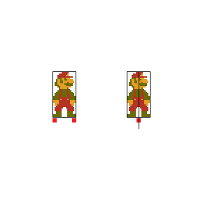
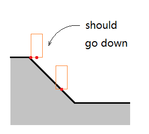
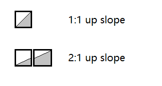
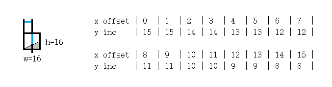
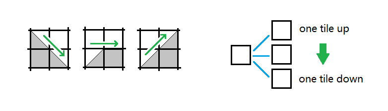

# 地面适配

地面适配指：检测实体与地面的接触，并根据结果调整实体状态。

## 变量onGround

onGround是每个动态实体都应有的标志变量。它的含义是：是否与地面或者支撑物（如运送板）（的上方）*接触*。它非常重要：

1.对于玩家，只有onGround为true时，才允许跳跃

2.只有onGround为false时，才进行纵向推进（跳跃或摔落）

3.它具有独立的含义。虽然每帧都能通过碰撞检测知晓实体脚下是否有地面，但是这个变量的存在并不重复。在玩家开始起跳、刚刚离地时，仍可以检测到地面，却已不on the ground。

4.根据onGround，地面适配的方案不同。

## 两种情况

地面适配有两种含义。

实体在地面时（onGround==true）：

a.在左右移动后，调整玩家的海拔到刚好接触地面的位置。

b.若实体脚下已无地面，让它开始下落。（方法是设置onGround=false）

实体离开地面时（onGround==false）：

若实体正在下落（ySpeed>=0）且已扎入地面：1.调整实体到刚好接触地面。2.停止下落。（方法是设置onGround=true并将ySpeed清零）

## 在TileMap上表示的地面

一般取实体脚下的点，根据它们所在tile是否为地面tile来检测地面。

有两种取点的方法：一种是在两侧脚下（因为实体有朝向，左右脚在转身时会对调，但不影响这两个点）各取一个；另一种则是在玩家中线下方取。



使用第一种方法，由于只有双脚下都无地面tile时才认定踩空，可以让实体更难在边界处掉下。


但是在坡路上最好使用中线取法。

如果打算只对坡路采用中线取法，为了兼容坡路与平路接触的位置，应该先使用中线取法检测，发现坡路tile时进行坡路处理，否则回到两脚取法。



## 作为地面的运送板

不仅地面tile，运送板以及任何悬于空中、可被其他实体踩在脚下的实体都可充当地面。

可以根据玩家脚下的点是否位于它们的包装盒内来检测。如果运送板太薄，实体的纵向速度较大，那么应该把检测矩形向下拉长。

相反，如果运送板太厚，应该把矩形缩短。否则可能让从侧方进入的玩家自动提升到运送板上。

（这本质上是矛盾的，不完美但是够用）

运送板移动时，会带动它背上的实体一起移动，因此需要知道它背上有哪些实体。可以在那时重复查找一次，也可以在检测地面时缓存。缓存法导致一帧之内运送板的运动被限制在这些实体（运动后）检测地面之后。

如果只有玩家可以登上运送板，可以设置一个变量onPlatformNum，缓存与之接触的运送板编号。

如果有多个实体可以登上运送板，可以给每个运送板分配一个列表，缓存与之接触的实体。

## 坡路的表示与适配

坡路以及崎岖不平的路面，可以在TileMap上存储，并被实体适配。

前面说实体在地面上时左右移动后，需要调整玩家到刚接触地面的位置，就是指有坡路的情况。如果不存在坡路，这种调整是不必要的。

1.准备坡路对应的tile



2.存储坡路tile的地形数据，用于适配

下图所示的方式，存储了距tile左端多少像素处的那列，地面到tile顶端的距离。



若检测到此tile在实体中线下，那么根据实体中线距tile左端的距离，把它纵向搬到tile顶端+对应距离处。

（一般令<code>entity.y = tile.y + tile.terrainData[xOffset] - entity.height</code>）

3.实体左右移动，若脱离当前地面tile，则下一地面tile在之上、之下或与之平行。所以左右移动时需要从上到下检测3个tile，以最先检测到的为准进行适配。



4.如果比较认真，可以在实体上坡、下坡时使用高于、低于地面行走的速度。否则坡路上行走的速度看上去比平路行走的速度要快。

例：Earthworm Jim中TileMap的数据结构（使用IDA得到）

（似乎只使用TileMap做碰撞处理，而没有把图像划分成tile）


```cpp
struct TileInfo
{
	short terrainPattern;         // 地形数据的编号
	char tileType;
	char unknown;
};

struct TerrainData
{
	char yInc[16];
};

int TileMap[NROWS][NCOLS];        // 稀疏存储各位置tile的序号
TileInfo TileInfoArr[MAX_TILES];  // 各tile的信息
TerrainData TerrainPatterns[256]; // 所有地形数据
```
