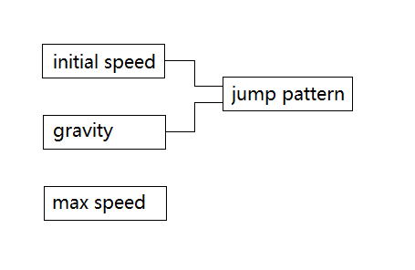

# 跳跃和摔落

一种跳跃模式由两种因素决定：初速度和重力加速度的变化模式。

为了防止纵向速度增长到过大（如：每帧走超过1个tile的高度）影响碰撞检测，常会设置一个最大速度。



## 基础

制造一次跳跃：

（无论是因为玩家按下A键、玩家踩死怪物还是玩家被弹簧弹起）

若是玩家主动跳跃，请加上<code>if(player.onGround)</code>的判断。

```java
entity.ySpeed = -10; // 初速度
entity.onGround = false;
```

让实体摔落：

```java
entity.onGround = false;
```

让实体着陆：

```java
entity.ySpeed = 0;
entity.onGround = true;
```

每帧运行的更新实体纵向位置的代码：

```java
final int GRAVITY = 1; // 重力加速度
final int MAX_Y_SPEED = 10; // 最大下落速度

if (!entity.onGround) {
	entity.y += entity.ySpeed;
    entity.ySpeed = min(entity.ySpeed + GRAVITY, MAX_Y_SPEED);
}
```

## 常见手法

### 实现“跑得越快，跳得越高”

把玩家的跳跃初速度与起跳时的横向速度关联。

```java
int initialSpeed;
int xSpeedAbs = Math.abs(player.xSpeed);
if (xSpeedAbs < 16)
	initialSpeed = -4;
else if (xSpeedAbs < 25)
	initialSpeed = -5;
else
	initialSpeed = -6;
```

### 实现“按住B键跳跃时，跳得更高”

与上面类似。把玩家的跳跃初速度与起跳时B键是否按下相关联。

```java
int initialSpeed;
initialSpeed = bKeyPressed ? -5 : -4;
```

### 实现“按住A键的时间越长，跳得越高”

实现这种效果的关键在于：准备两个重力加速度，一旦松开A键就切换到较大的那个。

```java
boolean jumping = false;
boolean prevAKeyPressed = false;
final int JUMP_GRAVITY = 4;
final int FALL_GRAVITY = 10;
```

起跳时：

```java
player.onGround = false;
player.ySpeed = INITIAL_SPEED;
jumping = true;
```

检测A键松开：

```java
// A键松开或已开始下落
if (jumping && (!aKeyPressed || player.ySpeed >= 0))
	jumping = false;
```

施加重力加速度：

```java
player.ySpeed += jumping ? JUMP_GRAVITY : FALL_GRAVITY;
```

一般使JUMP\_GRAVITY小于FALL\_GRAVITY但大于0。Earthworm Jim使用了更为极端的方案：使用负的JUMP\_GRAVITY。它的实现参见下面。

### 弹跳效果


实现弹跳效果的思路非常简单：若在下落时碰到地面，就重新设置一个向上的速度。

```java
if (entity collides with ground && entity.ySpeed >= 0) {
	entity.ySpeed = - 3;
}
```

演示程序：FireBall。

### 缓慢更新跳跃速度

这里使用的技巧是：用定点小数表示速度。使用一个16位整数表示速度，但只把它的前8位当做整数部分。

```java
short ySubSpeed = 0;

player.y += (player.ySubSpeed >> 8); // 默认的算术右移会保留符号
player.ySubSpeed += GRAVITY; // 相当于一次加上 GRAVITY/256
```

上面的代码忽略了速度的“小数部分”累加的影响，这种做法的误差可以接受。如果需要更严格的方案，可将玩家的纵坐标也使用定点小数表示：

```cpp
player.subY = player.ySubSpeed;
player.ySubSpeed += GRAVITY;

int getPlayerY() {
	return player.subY >> 8;
}
```

## Earthworm Jim中的跳跃算法

Earthworm Jim使用一个向上的加速度作为JUMP\_GRAVITY。在玩家松开A键或定时器过期时才切换回FALL\_GRAVITY。

（使用IDA得出）

```cpp
bool IsPlayerJumping = false; // 玩家是否在跳跃（包括跳跃后的下落）
int FramesJumpPressed = 0; // 跳跃键按下持续的帧数，0表示失效
int PlayerYSpeed = 0;
int PlayerY;

if (player will jump) {
	IsPlayerJumping = true;
	FramesJumpPressed = 1;
	PlayerYSpeed = -256;
}

...

if (IsPlayerJumping) {
	if (FramesJumpPressed != 0 && FramesJumpPressed != 12) {
		FramesJumpPressed++;
		if (IsKeyJumpPressed) {
			PlayerYSpeed -= 120; // -120 + 60 = -60
		} else {
			FrameJumpPressed = 0;
		}
	}
}

...

if (player jumping or falling) {
	PlayerY += PlayerYSpeed;
	PlayerYSpeed += 60;
}

...

if (player landed) {
	IsPlayerJumping = false;
	PlayerYSpeed = 0;
}
```
