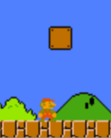

# 移动与修正

## 移动的准则

移动应分为3步：

1.改变实体坐标

2.检测碰撞（常涉及到对铺砖地图的查询）

3.修正实体位置（把实体从它碰入的实体中拔出）

制定这样的顺序，是因为：是否需要修正取决于是否发生了碰撞；你不想把错误的画面输出给用户。

（TODO “错误的画面” “正确的画面”）

## 修正的方式

有两种修正位置的方案。

一种是快速修正，在一帧之内，通过计算，把实体放到正确的位置。任天堂超级玛丽中，完整砖块的大小是16x16，说明砖块的坐标必定都是16的倍数，玩家的大小是16x16或者16x32。检测到玩家扎入地面后，游戏会去掉玩家y坐标中16此倍数的多余部分。玩家会因此马上回到地面上。

```cpp
BYTE playerY;
playerY = playerY & 0xF0; // 相当于 playerY -= playerY % 16;
```

另一种是缓慢修正，每帧修正一点，通过多帧修正完。任天堂超级玛丽中，玩家跳跃时，如果玩家头顶中央没有砖块，但身体两侧碰触了砖块，游戏会每帧给玩家x坐标加1/减1，导致玩家渐渐疏离砖块。这样就把修正的过程暴露给了玩家。

演示程序ImpedePlayerMove展示了这一算法。



当没有直接的快速修正方法时，可循环应用缓慢修正方法，直至修正完成。下面的伪代码演示了如何使用这一思路把玩家拔出地面（假定地面通过位图表示）。

```java
while (referenceLayer.getColorAt(playerX, playerY) == COLOR_GROUND)
	playerY--;
```
