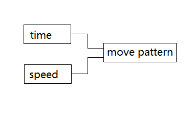
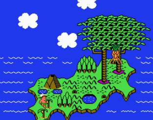

# 运动模型

速度和时间的变化模式，决定了实体的运动模式。



__应用1：如果难以通过改变速度的变化模式来达到效果，就尝试改变时间的变换模式。__

例：通过timing function扭曲时间实现伪物理效果。

__应用2：如果难以实现速度恒定的运动，就尝试实现时间恒定的运动。__

玩家在《冒险岛2》中通过一关后，会回到地图界面，展示玩家从此关地点沿直线移动到下关地点的动画。



各关卡地点的坐标存储在数组中。若实现这样的动画，有两种选择：1.保持速度恒定，两个位置相隔越远，用时越长；2.保持时间恒定，无论路程长短，都使用相同时间到达。这两种行为的实现成本大不相同。

两种方法都需要计算速度向量，即每帧在x和y方向上行进的距离。假设分别是两地坐标分别为__A__和__B__，那么第一种选择的计算是：

```
恒定的速度 v 事先确定
单位向量 e = (B - A) / sqrt(|A|² + |B|²)
v1 = v · e
```

第二种则是：

```
恒定的时间 t 事先确定
v2 = (B - A) / t
```

游戏使用了第二种做法。因为对于该游戏使用的6502芯片来说，乘除、平方和开平方根都不是原生操作，不管是通过查找表还是手工实现，开销都极大。

演示PathMove展示了其实现原理。（原游戏对这一算法的实现中，连真正的除法操作都没有使用。）
