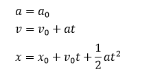
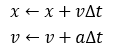
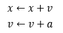

# 数值积分

数值积分是游戏物理模拟中使用的方法。

## 简化模型

此类游戏只模拟实体移动，不（用物理方法）模拟实体的转动、破碎、变形，所以只需要线性动力学（把物体看做质点，分析质点运动）的知识。用下面的办法可以做进一步的化简：

1.消去F: 把F换成对应的加速度a，直接使用a控制物体速度变化。

2.消去m: 两物体碰撞后，我们手动设置速度值，而不是使用冲量公式，所以不需要m.

3.自定g: 地球（赤道处）的重力加速度g≈9.8m/s²，但游戏里可以设置一个不同的值，甚至在游戏运行时改变/切换。

这样，实现物理模拟只需要使用下面的（初中）物理学公式：



然而游戏是一个互动模拟，实体位置和速度的变化，不能用简单的函数式表达。一些短时间、有规律的情况，可能会套用这些公式。但大多数情况下，都是使用一些数值积分的算法。

## 欧拉法

最简单的数值积分方法是**显式欧拉法**（简称欧拉法），它在每帧做如下赋值运算：



其中Δt表示两帧相隔时间。与物理中使用m和s分别作为位置和时间单位不同，游戏中我们通常取像素为位置单位，取两帧相隔时间为时间单位，所以x、v、a三个变量的单位分别是

```
x: 像素
v: 像素/帧
a: 像素/帧²
```

于是欧拉法的公式可简化成：



到C/C++/Java中就变成了：

```java
entity.x += entity.xSpeed;
entity.xSpeed += accel;
```

欧拉法简单、易实现，所有老游戏都在使用它。

## 欧拉法的缺陷

欧拉法有两个问题：

1.误差很大。假设实体以恒定的、非零加速度移动，速度必然呈线性变化。欧拉法假定实体在一帧内使用帧开头处的速度匀速运动，忽略了帧内速度的变化。

虽然有误差，但如果加速度较小，误差就不会大到让画面显得不真实的程度。现代游戏仍然可以使用它。

2.过量应用。应用加速度、速度超过预期的距离，这是所有数值积分方法都会有的问题。

下面的图中，蓝线两边的实体受不同的加速度。一个实体将越过蓝线。一帧模拟后，实体很难刚好达到蓝线处，而是移动到蓝线右边一点点的位置，这种模拟是按照加速度保持a=10进行的，但加速度在实体越过蓝线的那一刹那就变成了-10。所以加速度a=10多发挥了一点作用。


为了避免这种问题，常会检查物体是否刚好跨过分界线，如果是，则把物体归位到分界线。这样仍然不准确，相当于放弃了一部分帧时间，但是能避免实体在分界线处来回振荡的问题。

一些现代游戏需要很高的精确度，因而使用了误差更小的方法，如韦尔莱积分。（可参考维基百科或《游戏引擎架构》）

演示程序BrickShatter：超级玛丽顶碎砖块的效果，翻录了原版数据和源代码。
