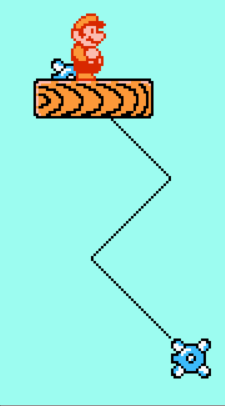

# 运送板

指悬在空中可以当做地面、带动背上物体移动的实体。英文叫platform.

通常这类板只为玩家服务，程序员不实现怪物与它们碰撞的代码，关卡设计师会极力避免怪物落在上面而暴露缺陷。下面以玩家为中心讨论，但实际上怪物与之的交互也可以实现。

## 运动模式

振荡。上下、左右、或者对角方向。参见*振荡效果*。

循环。在运送板到达屏幕最上方时，将它放到屏幕最下方。任天堂超级玛丽1中Level 1-2中出现过。

按路线移动。



在玩家踩上时跌落。可以使用标志变量实现。一旦检测到玩家与之在上方接触，就开启此变量。若此变量为真，就对它施加重力，用使玩家下落的方式实现它的下落。

## 碰撞类型

首先，运送板是一种地面，意味着它要被当做地面处理：

（参见：*地面适配*）

如果玩家下落时从上方扎入，要停止下落。（设置onGround为true，并将玩家纵向速度归零）

玩家站在上面左右移动时，若脚下还有运送板，不可让玩家进入跌落状态，否则让玩家掉落。（设置onGround为false）

为此，要把对运送板的检测加入这两种地面适配的情况中。虽是两种情况，但两种情况下的检测方法无异，对玩家是否接触的检测结果，对应的处理方法也相同，可以归为一段。

运送板的碰撞类型有两种：

1.云彩。玩家脚下与运送板接触，把运送板看做地面。若玩家与之在别的方向（左/右/下）接触，不处理。

2.木板。运送板是“实心”的。也作为地面。玩家若在左右与之接触，会被挤出；若从下方跳入，则让玩家下落。

检测玩家与它们的碰撞，都是先用AABB法判定包装盒是否有重合。之后通过边界线间距判定是在哪个方向发生了接触。

“云彩”很容易实现：

```java
Rect playerRect = player.getBoundingBox();
Rect platformRect = platform.getBoundingBox();
if (overlap(playerRect, platformRect) && playerRect.bottom - platformRect.top < TOLERANCE) {
	// 与板上方接触
    ...
}
```

“木板”则要复杂很多，下面是任天堂超级玛丽1中的实现：

```java
Rect playerRect = player.getBoundingBox();
Rect platformRect = platform.getBoundingBox();
if (overlap(playerRect, platformRect)) {
    if (platformRect.bottom - playerRect.top < 4) {
        // 从板下方接触 --> 让玩家下落
        player.ySpeed = 1;
    } else if (playerRect.bottom - platformRect.top < 6) {
        // 从板上方接触
        ...
    } else {
        // 从板左/右接触
        if (playerRect.right - platformRect.left < 8)
            player.x--;
        else if (platformRect.right - playerRect.left < 10) // 此处的判断没有必要
            player.x++;
    }
}
```

我推荐使用“云彩”类型的板，因为它容易实现，对玩家更友好。

## 带动背上实体

玩家被“带动”指：如果玩家站在运送板上，运送板移动时会托着他一起移动。

实现带动的关键是，如果玩家在运送板移动之前就站在上面（需要检测），那么运送板移动后，也应调整玩家使之继续保持与运送板在上方的接触。**检测-移动-调整**的顺序不可改变。玩家与传送板上方接触的状态，必须一直保持。

我们倾向于把脚已经进入运送板上方的玩家直接拔出，这样就会让玩家的包装盒下沿与运送板包装盒的上沿恰好重合。既然玩家已经被拔出，这种情况是否要当做接触呢？必须这样做，否则就无法保持接触的状态，玩家也就不会被持续带动了。如果有必要，把玩家的脚停到运送板上沿靠下一点的位置，或者把运送板包装盒的上沿微微向上拉一些。

玩家的ySpeed若是向上的，说明玩家想要跳起，已不再与板接触，这时不应进行带动。

*地面适配*中说过，玩家与板之间的碰撞检测每帧要进行两次，第一次用来判断玩家脚下是否有地面，第二次用来判断运送板上是否有玩家。为了节省，可以在第一次检测时，就存储这帧玩家与之接触的运送板的编号；也可以省略第一次判断：检测掉落时，若玩家脚下没有普通地面，则将onGround设为false，之后若检测到还有运送板，则将onGround设回true；检测着陆时，若玩家碰到运送板，需要将玩家的位置调整好，这正是“带动”代码的一部分。

对于存在y方向移动的板，调整的办法是直接设置坐标。

```java
platform.move();
if (curPlatform == platform && player.ySpeed >= 0) {
	player.y = platform.top - player.height;
}
```

对于存在x方向移动的板，调整的方法是记录板在此帧x方向的移动量，加到玩家的x坐标上。

```java
int xInc = platform.move(); // 返回横向移动量
if (curPlatform == platform && player.ySpeed >= 0) {
	player.x += xInc;
}
```
