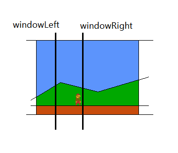
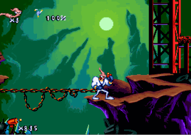

# 卷轴滚动

最平常的配置是只设置x方向的滚动，但这些游戏里有的关卡x、y方向都有滚动。y方向滚动的实现原理与x方向相同，所以下面只介绍x方向。

## 两种坐标方案

引入滚动后，有两种方法表示玩家、怪物这类实体的坐标。

屏幕坐标：使用它们在屏幕上的位置。

全局坐标：使用它们在整张地图上的位置。

我们还需要存储当前滚动的量。可以用屏幕左边线在地图上所处的x坐标来表示（变量起名叫screenLeft）。

假设有一张背景图，那么玩家向前（向右）移动滚动了多少，背景图就需要向左移动多少。背景图x坐标backgroundX与screenLeft互为相反数。

屏幕坐标可以直接用于绘图，屏幕坐标的数字也较小（对于任天堂FC主机，一个字节就可以存储），方便进行碰撞检测计算（现代计算机能一次性计算很大的数字，这已不再是优势）。在滚动时，所有实体（可能除了玩家）的屏幕坐标都要随之更新，这种计算有些多余。

我推荐使用全局坐标。除了上面屏幕坐标的问题，还因为它符合我们的直觉。（玩家如果移动了但屏幕上的位置没有动，他的坐标应该改变）使用全局坐标，在绘图时需要调整到屏幕（如下）。也可以使用图像引擎的平移变换。

```java
int x = player.x - screenLeft;
```

以下代码都使用全局坐标。

## 实现滚动



要在屏幕上设置一个x坐标的范围，如果玩家超过了左边线，则将屏幕向右滚动；如果超过了右边线，则向左滚动。有些人喜欢让这个范围关于屏幕中央对称，有的人则设置得靠左。

如果已经到达地图边缘，则不进行滚动。

理解“滚动”的另一种办法是，玩家如果在边线（无论哪条）上发生移动，屏幕滚动后，玩家的屏幕坐标应该仍与边线坐标相同，这样就能列方程求解滚动后的screenLeft.

滚动屏幕应该放在所有改变玩家x坐标的动作之后。玩家行走、被运送板带动，是改变玩家x坐标的通常原因。

```java
final int windowLeft = 30, windowRight = 70;
if (player.x - screenLeft < windowLeft) {
	// 更完整应写：screenLeft -= windowLeft - (player.x - screenLeft);
    screenLeft = player.x - windowLeft;
    if (screenLeft < 0)
    	screenLeft = 0;
} else if (player.x - screenLeft > windowRight) {
	screenLeft = player.x - windowRight;
    if (screenLeft + screenWidth > mapRight)
    	screenLeft = mapRight - screenWidth;
}
```

## 实现轻随效果



轻随（Easing）指的是离物体越远，就用越快的速度去追它。追随的速度与离目标位置的距离成正比。

（其中k是一个小于1的正数）

```
currentPos += (targetPos - currentPos) * k
```

滚动可以看作拍摄玩家的摄像头在追随玩家，对于普通的滚动，摄像头与玩家移动的速度相同。

可以把轻随效果应用于滚动，这时不再使用两条边线，而是设置一条中心线，玩家离中心线越远，使用越高的速度滚屏，最终目标是让玩家(在屏幕上）的x与中心线重合。使用轻随后，摄像头不再立即追上玩家，而要用一段时间。

```java
// player.x - target_screenLeft = windowCenterX
float diff = ((player.x - windowCenterX - screenLeft) / 5;
screenLeft += diff;
if (screenLeft < 0)
	screenLeft = 0;
else if (screenLeft + screenWidth > mapRight)
	screenLeft = mapRight - screenWidth;
```

如果玩家一直右行，离中心线的距离会越来越大，但增大到一定程度就会稳定，不再变化。计算这个稳定距离的方程是

```
k * maxDist = MAX_X_SPEED
```

Fancy Pants Adventure和Earthworm Jim中都使用了轻随实现滚屏。前者还根据玩家的朝向，使用不同的中心线。

## 窗口机制

窗口机制与卷轴滚动配合使用。它的含义是：怪物（以及其他动态实体）在快要进入窗口时才创生，在离开窗口一定距离后毁灭。窗口指地图出现在屏幕上的那一部分。

窗口机制非常有用。如果没有它，任天堂超级玛丽中，关卡后面的怪物会过早创生，在玩家到达前就跌入沟内。

老游戏会在怪物离开窗口不远后销毁它们，这样可以节省内存。已经全身在窗口外（但还没被销毁）的怪物不会被绘制，于是节省了绘图时间。

任天堂超级玛丽3中，玩家可以任意前后前进。如果玩家前进之后后退，由于玩家前进而销毁的怪物，会在玩家后退到那处时，重新被创建。

老游戏没有直接通过TileMap定义关卡，而喜欢把地图里的地面（以及其他静态实体）和怪物（以及其他动态实体）的描述（类型、x、y、长度等）各存成一个数组，在需要时“解压”到内存。为了服务窗口机制，每个数组中的实体都是按照x坐标排好序的。

现代游戏已不再像老游戏那样缺少内存。可以在关卡加载时就创建所有怪物，让怪物在移入窗口时苏醒，移出窗口时沉睡。沉睡的怪物每帧不更新其状态。这种做法可能会让玩家有一种“你们在我能看见时才行动”的感觉，但玩家不太会觉得很怪，怪物本应表演。

但是，不要在怪物的身体完全移入窗口时才唤醒它，那样太做作。

```java
int screenRight = screenLeft + screenWidth;
int activeLeft = screenLeft - DIST;
int activeRight = screenRight + DIST;
boolean inside = (enemy.x + enemy.width > activeLeft && enemy.x < activeRight);
if (enemy.awake == false) {
	if (inside)
    	enemy.awake = true;
} else {
	if (!inside)
    	enemy.awake = false;
    else
		enemy.update();
}
```
