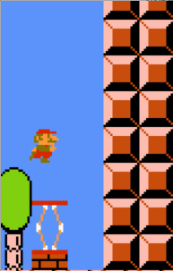
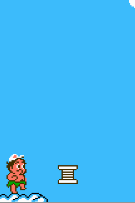

# 弹簧

## 自动弹簧



这种弹簧最早出现在任天堂超级玛丽的2-1关，看上去：

- 玩家一旦踩上去，就会把弹簧压倒最低，然后被弹簧弹起。
- 玩家若在弹簧被压到最低时按下A键，弹起后会跳得更高。

实现这种弹簧的关键是，一旦玩家接触弹簧顶端，就接管玩家的纵向运动，之后播放弹簧从压下到完全弹起的动画。期间的每帧，把玩家的纵向位置调整到刚好接触弹簧顶部。这样就给人一种“玩家压缩弹簧到极限，而后又被弹起”的错觉。

接管可以用一个标志变量实现，参见*两种控制模式*。

弹簧动画播放完毕/快要结束时，就给玩家一个向上的初速使之跳起。为了实现了第二点，需要在弹簧动画播放的某几帧内检测A键是否按下过。如果有，就在跳起时给玩家一个更大的初速。

```java
int curSpring = -1;
boolean willJumpHigher;
final int[] springOffsetTable = { ... }; // 弹簧每帧下降到的位置

// 每帧判定是否纵向移动玩家时
if (!onGround && curSpring == -1)
	...

// 每帧做碰撞检测时
if (curSpring == -1 && player.ySpeed >= 0) {
	Rect playerRect = player.getBoundingBox();
	for (int i = 0; i < springs.length; i++) {
    	Rect springRect = springs[i].getBoundingBox();
        if (overlap(playerRect, springRect) && playerRect.bottom - springRect.top < TOLERANCE) {
        	curSpring = i;
            willJumpHigher = false;
            springs[i].startAnimation();
            break;
        }
    }
}

// 更新弹簧状态时
if (curSpring >= 0) {
	int frameNo = springs[curSpring].getAnimationFrame();
    player.y = springs[curSpring].y + springOffsetTable[frameNo] - player.height;
	if (frameNo >= FRAME_CHECK_BEGIN && frameNo <= FRAME_CHECK_END) {
    	if (!prevAKeyPressed && aKeyPressed) {
        	willJumpHigher = true;
        }
    } else if (frameNo == FRAME_LAUNCH) {
    	curSpring = -1;
        player.ySpeed = willJumpHigher ? -HIGH_SPEED : -LOW_SPEED;
        player.onGround = false;
    }
}
```

## 触发式弹簧



↑冒险岛2奖励关卡中的触发式弹簧

这种弹簧有两种状态：压下（默认）和弹开。

玩家若在弹簧压下时落在上面，会被弹起，弹簧也会弹开。

玩家若在弹簧处于弹开状态时落在上面，会让弹簧切换到压下状态，并着陆在处于压下状态的弹簧上。

它的实现与上面类似，除了：

- 压下时，作为一种地面。
	- 如果最终状态是压下，那么要设置onGround为true
	- 检测玩家的脚与之接触时，只在纵向速度严格大于0时才认为是踩，否则不触发
- 要准备两部分动画。踩中它时，根据它所处的状态，决定使用哪一段。
