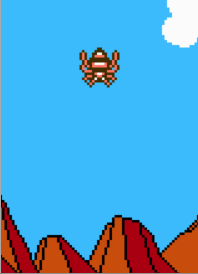
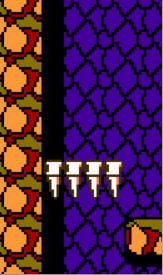
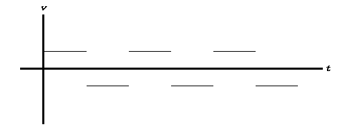
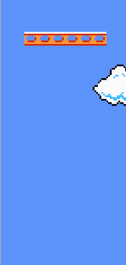
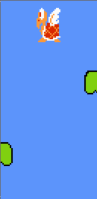
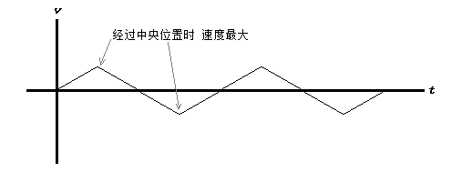
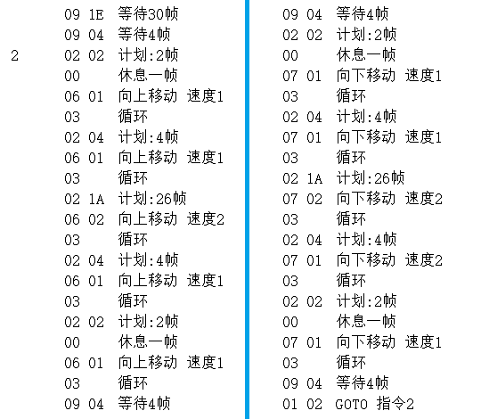
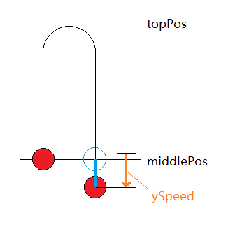

# 振荡效果

此类游戏常需要实现让实体（通常是怪物）来回运动的效果。



## 实现方案

### 线性运动

使用这种方法运动的实体，上升和下落使用恒定的速度。此外要设置一个标志变量保存当前运动方向。

一般上升下落使用相同大小的速度。不过也可以故意调整得相对悬殊，实现特殊效果。



这种实现方法的速度图像形似方波。



```java
if (yDir == 1) {
	y += DOWN_SPEED;
    if (y >= bottomPos) {
    	y = bottomPos;
        yDir = -1;
    }
} else {
	y -= UP_SPEED;
    if (y <= topPos) {
    	y = topPos;
        yDir = 1;
    }
}
```

### 参照三角函数

可以用sin/cos函数的值指导振荡：

```java
y = middlePos + (int) (amplitude * sin(radians(degree)));
degree = (degree + 10) % 360;
```

其中radians是Processing自带的角度转为弧度的函数，它完成的工作是：

```java
float radians(float deg) {
	return Math.PI * deg / 180.0f;
}
```

### 马里奥式物理模拟

如图为任天堂超级玛丽中纵向振荡的运送板，在内部，它与纵向来回移动的红乌龟共享了同一段代码。

 

↑由于录像误差二者并不同步 :(

这种运动模式非常容易实现：实体拥有自己的y方向速度。若实体在中央高度之上，就施加一个向下的加速度；若实体在中央高度之下，就施加一个向上的加速度。两加速度大小相等，方向相反。

这样就做到了“回旋式飞镖”的效果。

但它有一个致命的问题：由于存在误差，随着一次次来回，实体的振幅会越来越大。（文末有分析）

为了保持振幅，可以在实体越过顶部时，把实体拉回顶部位置。任天堂超级玛丽中，若发现实体越过顶部，则临时弃用这种运动方式，改成每8帧纵坐标加一，直到实体回归顶部。

下图为这种方法的速度图像。



```java
if (y < topPos) {
	// 相当于frameCount % 8 == 0
    // 是减速措施，每8帧才下降1像素
	if ((frameCount & 7) == 0)
    	y++;
} else {
	y += ySpeed;
	if (y < middlePos)
    	ySpeed += ACCEL;
    else
    	ySpeed -= ACCEL;
}
```

### 数据驱动

或者把运动模式记录在数组中。

通用代码：

```java
if (yDir == 1) {
	if (++frameIndex >= table.length) {
    	frameIndex = table.length - 1;
    	yDir = -1;
    }
} else {
	if (--frameIndex < 0) {
    	frameIndex = 0;
        yDir = 1;
    }
}
```

可以在数组中存储每帧相对于顶部的偏移：

```java
final int[] table = { 0,1,2,3,4,6,8,10,12,14,16,18,20,21,22,23,24 };
y = table[frameIndex];
```

也可存储每两帧之间的坐标差：

```java
final int[] table = { 1,1,1,1,2,2,2,2,2,2,2,2,1,1,1,1 };
if (yDir == 1)
	y += table[frameIndex];
else
	y -= table[frameIndex];
```

乍看上去这种方法只是用数组表示了函数。但请别这么想，因为有更复杂的数据驱动方式：

冒险岛2的作者设计了一种“动画语言”，用于描述实体运动，并编写了这种语言的“解释器”，以播放运动效果。下图为蜘蛛上下运动动画的表示。

演示程序Spider翻录了它的部分算法。



注：实现振荡效果只是数据驱动的一种应用。

## 叠加到其他运动

可以让实体一边振荡一边进行其他运动，这样往往能制造一些有趣的效果。

这样做需要保存其他运动的位置作为基础坐标。每次生成实体位置时，用基础坐标加上振荡产生的偏移量得到最终坐标。

Earthworm Jim中，玩家打死怪物后，怪物吸收玩家的“能量”会归还给玩家。这些能量会绕着螺旋（x方向参照sin函数振荡）逐渐向玩家靠拢，直至被玩家“吸收”。

## 附：为什么马里奥振荡的振幅会越来越大？

马里奥振荡等同于：把一个小球竖直向上以v0抛了出去（忽略空气阻力），之后接住，然后再演一遍，这次使用镜面效果。

若在抛出高度（middlePos）处接住小球，重力势能不改变，相当于重力不做功。于是小球被接住时速度大小仍是v0.

但我们的物理模拟往往不会恰好在中线（middlePos）处“接住”小球（而是让小球跨过）。小球开始受到相反的重力时，已经越过中线。这就相当于在略低于抛出高度的位置接住了小球。小球多走的这一段，重力做功，导致接住时速度大小大于v0.



不仅如此，接住时低于抛出高度还意味着，下一次抛出时，其实是在略高于首次抛出高度的位置抛出的。

于是再次在首次抛出高度处接住小球时，小球的速度已经变大。小球的速度变大，动能增加，能运动到的范围当然变大。这样的变化累加，导致振幅越来越大。
