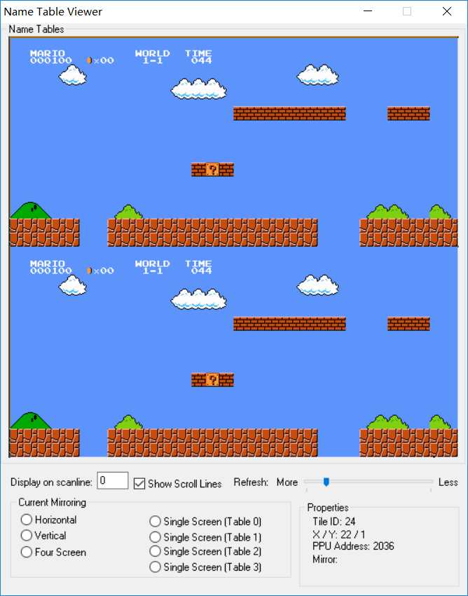
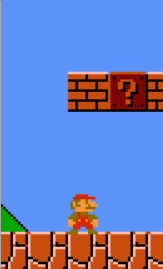

# TileMap

TileMap中文名叫瓦片地图，指按行列平铺一块块等大小的瓦片（tile）来描述关卡的机制。

TileMap非常有用，任天堂FC主机甚至在硬件层次支持它，在显存里专门分配了空间用来存储，这套机制在FC主机中叫Name Table，可以在FCEUX模拟器的Debug » Name table Viewer来查看一个游戏当前的Name Table.



TileMap用于绘图和碰撞检测。如果你不喜欢用tiles一块一块铺出关卡图片，可以使用一张或几张背景图和前景图，把TileMap只用于碰撞，例如在背景图地面的位置，铺上表示地面的砖块。

## 数据结构

老游戏对TileMap进行稀疏存储，用到时再“解压”到屏幕缓存中。例如任天堂超级玛丽1中<code>0x47 0x24</code>表示在(4,7)格处，有一排长度为5(=4+1)的砖块(2)。现代硬件的内存资源比过去大了几个数量级，压缩存放以节省内存的意义不大，可以直接使用二维数组来存储：

```cpp
// C++
// NROWS --> number of rows
// NCOLS --> number of columns
char tileMap[NROWS][NCOLS];
```

或者用一维数组模拟二维：

```cpp
// C++
char tileMap[NROWS * NCOLS];

char &refTile(int x, int y)
{
	return tileMap[y * NCOLS + NROWS];
}
```

最简单的TileMap，每个格的内容使用一个数字表示即可，每个数字占1个字节。数字表示tile的类型，这个类型是碰撞处理的依据。每种tile对应一张图片和一种碰撞处理（如：*air*，不参与碰撞；*breakable*，可被撞碎；*support*，能被玩家踩于脚下；*solid*，玩家不可穿过），可以用一个表格（数组）来存储这些元信息，以供查询。

在哪里出现什么敌人（以及其他动态对象）也可以放到TileMap的格子中，这种表示法适合在地图编辑器中使用。但是如果内部存储也是这样，就意味着每次玩家前进时，都要扫描最右一列的TileMap来创建新敌人. 为了避免扫描TileMap，可以把敌人按顺序单独存储在一个列表里，不断在列表中取数据来指导敌人创建。

关卡地图是静态存储的，但TileMap可以在运行时被修改（例如，被撞碎的砖块应该在TileMap中擦除）。加载关卡时要将前者复制到后者。

## Tile动画

有时需要让某块tile发生移动，但只依靠修改TileMap无法完成平滑移动。老游戏对此的解决方案是：先把原来位置的tile抹掉，使用它的图案创建一个sprite，让sprite从这个位置开始移动，移动后若还需要恢复到TileMap，则销毁sprite，在TileMap上对应位置写回这个tile。

任天堂超级玛丽中，砖块被弹起、归位就是这样实现的。


