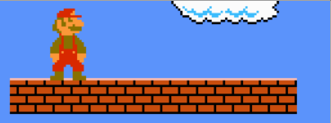
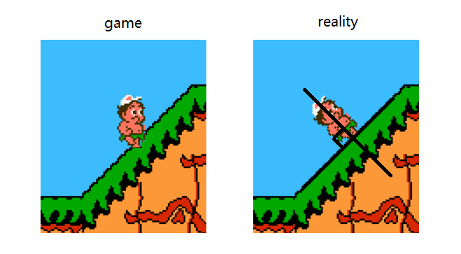
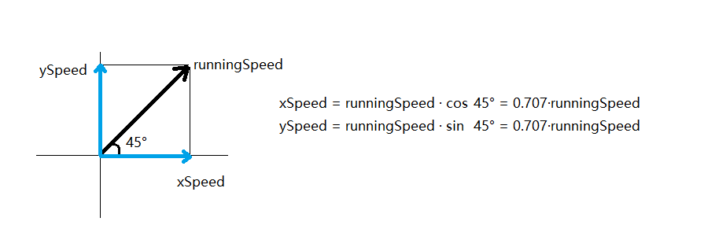

# 行走

## 最简单的行走

左右键按下时匀速前进，松开时停止运动。

```java
if (leftKeyPressed)
	entity.x -= SPEED;
else if (rightKeyPressed)
	entity.x += SPEED;
```

## 标准行走的要素

更为复杂的行走中，左右键通过控制加速度间接改变速度。

每帧应进行以下物理模拟：

```java
int accel; // 加速度
entity.x += entity.speed;
entity.speed += accel;
```

### 左右键过滤

行走算法需要知道当前是仅左键按下（玩家想向左运动）、仅右键按下（玩家想向右运动）还是两键都没按下。

两键都按下的情况应被当做都没按下处理。不应作为第四种状态。

一种过滤算法：

```java
int leftRightKey;
if (leftKeyPressed == rightKeyPressed)
	leftRightKey = NONE;
else
    leftRightKey = leftKeyPressed ? LEFT : RIGHT;
```

如果使用bitset存储按键状态：

```java
int leftRightKey;
int keys = keypad & (KEY_LEFT | KEY_RIGHT);
if (keys == KEY_LEFT)
	leftRightKey = LEFT;
else if (keys == KEY_RIGHT)
	leftRightKey = RIGHT;
else
	leftRightKey = NONE;
```

### 朝向

玩家面朝左还是面朝右，不是物理模拟中的变量，但会在绘图时用到。

此类游戏确定玩家朝向使用的都是以下方法：

```java
int facingDir = RIGHT; // 默认朝右
if (leftRightKey != NONE)
	facingDir = leftRightKey;
```

可以只做向右移动的动画。向左移动的动画通过水平翻转（horizontal flip）实现。现代图形程序库都支持水平翻转sprite。

### 加速、减速和刹车

**加速**：按键使玩家速度加快的过程。

应该设置一个**最大横向速度**，防止玩家移动过快：

```java
final int MAX_X_SPEED = 12;
entity.xSpeed += accel;
if (entity.xSpeed > MAX_X_SPEED)
	entity.xSpeed = MAX_X_SPEED;
else if (entity.xSpeed < -MAX_X_SPEED)
	entity.xSpeed = -MAX_X_SPEED;
```

**减速**：松开按键，让玩家受“地面摩擦力”作用，减慢速度的过程。

**刹车**：按下与当前移动方向相反的按键，更快减速的过程。

玩家静止且没有按键时，处于**空闲**状态。

#### 分配加速度

如果加速时的加速度为a，那么可以把减速时的加速度设为-a，把刹车时的加速度设为-2a.

大概因为简洁，我研究的两款FC游戏（任天堂超级玛丽1和冒险岛2）都使用这种比例分配三种情况下的加速度。

空闲状态下的加速度为0。

#### 判定

为了决定使用哪个加速度，需要判定当前处于哪种情况。此外还需要知道加速度的方向（正→右/负→左）。

下面是一种判定方法：

```java
final int ACCEL_ACCEL = 2; // 加速时的加速度大小
final int ACCEL_DECEL = 2; // 减速时的加速度大小
final int ACCEL_BRAKE = 4; // 刹车时的加速度大小
int accel;
int runningDir;
if (entity.xSpeed > 0)
	runningDir = RIGHT;
else if (entity.xSpeed < 0)
	runningDir = LEFT;
else
	runningDir = leftRightKey;

int runningState;
if (leftRightKey == NONE)
	runningState = (runningDir == NONE) ? IDLE : DECEL;
else
    runningState = (leftRightKey == runningDir) ? ACCEL : BRAKE;

if (runningState == IDLE) {
	accel = 0;
} else if (runningState == DECEL) {
	accel = (runningDir == RIGHT) ? ACCEL_DECEL : -ACCEL_DECEL;
} else {
	accel = (runningState == ACCEL) ? ACCEL_ACCEL : -ACCEL_BRAKE;
    if (leftRightKey == LEFT)
        accel = -accel;
}
```

#### 刹车动画

可以给玩家准备刹车专用的“动作”。刹车动画的朝向可以与玩家速度方向一致（可直接使用上面的runningDir）。

（刹车时头已经转过，但脚还未转。所以我也不知道这个“朝向”应指代头还是脚。）



如果没有刹车动画，根据上面“朝向”部分的逻辑，刹车时玩家会马上面朝相反的方向。这也可以接受。

### B键冲刺

在B键按下时，玩家应该比平时走得要快。（所谓的“**冲刺**”）

这时至少应该放宽最大速度。可以使用更高的加速时加速度，也可不用。为了支持这样做，上面的MAX\_X\_SPEED和ACCEL\_ACCEL不应再是常量，应作为变量根据B键是否按下从各自的两值中取。

冲刺时玩家的速度可能已经超过平时的最大速度，此时松开B键，若让玩家的速度马上回到平时的最大速度，会显得很突兀。如果想要克服，可以采用延迟/减缓速度变化的手段。

任天堂超级玛丽中，一旦按下B键，RunningTimer会被置为10. 一旦松开B键，RunningTimer则会每帧减1，直至减为0。只要RunningTimer仍为非零，就采用冲刺用最大速度和冲刺用加速时加速度。所以放开B键时玩家不会马上切换到低速。

冒险岛2则使用了一种缓慢修正的方法。若玩家的速度超出最大速度，那么不再把加速度累加到速度上，而是让速度大小每帧减小1.

### 制动

现实中，汽车不会减速到与原来速度相反。所以游戏里的玩家也一样。

我自己写马里奥游戏时，经常遇到这种情况：玩家向右移动已减速到2，但减速时的加速度大小是5. 于是下一帧玩家速度变成-3，变成向左移动。再减速（+5），于是速度又变为2。速度在-3和2之间来回变动，导致本应该静止的玩家逐渐向左侧（-3+2=-1）晃动。每次我都不明所以。

因此，若处于减速/刹车状态，若玩家当前的速度再减就会跨过0线，在累加到玩家位置上之后，应直接置0.

```java
if ((runningState == DECEL && abs(entity.xSpeed) < ACCEL_DECEL) ||
    (runningState == BRAKE && abs(entity.xSpeed) < ACCEL_BRAKE))
    entity.xSpeed = 0;
```

### 空中移动

物理中学到，空气阻力一般比地面摩擦力要小。游戏中，玩家不与地面接触（onGround==false）时，也可以有不同的移动策略。

任天堂超级玛丽中，在空中没有减速和刹车（相当于减速和刹车时的加速度为0）。也不在空中改变朝向。

（顺便说一下，在空中行进和改变方向本身是违背物理规律的）

冒险岛2中，似乎没有准备专门的空中移动策略。

### 坡路移动

游戏中的坡路常给人一种错觉：玩家站在坡路上仍处于竖直状态。现实中，人站在坡路上，应与地面垂直。



所以把x方向速度作为行走速度已经不再合理。应该设置一个行走速度变量(runningSpeed)表示左右方向的速度，负数表示向后手方向（左右因朝向而变，但不影响这个变量的含义）走，正数表示向前手方向走。检测到脚下与坡路接触，则把行走速度按坡路方向分解成xSpeed和ySpeed. 如45°的坡路，令<code>xSpeed=ySpeed=runningSpeed * 0.707</code>. 这也意味着要存储不同坡路的分解因子。



速度只得到x方向的就足够。玩家纵向位置的提升/降低可以交给*地面适配*去完成。

老游戏主机不支持浮点乘法（甚至连整数乘法也要自己实现）。冒险岛2没有直接存储左右方向的速度，而是存储速度的索引（正数表示前行，负数表示后行，0表示静止），用索引乘以放缩因子得到最终速度。玩家在坡路上时，放缩因子比平路上要小。

由于重力有平行于坡路的分量，现实中的人上坡/下坡时的加速度不同。游戏中也可以模拟这种情况。超级玛丽奥兄弟3中就实现了这一点。但对游戏来说这不是必须的。如果要实现，应该把ACCEL\_*系列都设为变量，根据所在坡路的类型以及上/下坡，从表中或通过计算获取这三个变量的值。
