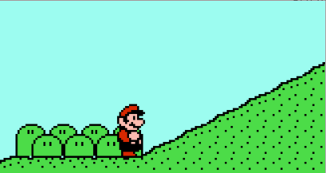

# 行走

## 最简单的行走

左右键按下时匀速前进，松开时停止运动。

```java
if (leftKeyPressed)
	entity.x -= SPEED;
else if (rightKeyPressed)
	entity.x += SPEED;
```

## 标准行走的要素

更为复杂的行走中，左右键通过控制加速度间接改变速度。

每帧应进行以下物理模拟：

```java
int accel; // 加速度
entity.x += entity.speed;
entity.speed += accel;
```

### 左右键过滤

行走算法需要知道当前是仅左键按下（玩家想向左运动）、仅右键按下（玩家想向右运动）还是两键都没按下。

两键都按下的情况应被当做都没按下处理。不应作为第四种状态。

一种过滤算法：

```java
int leftRightKey;
if (leftKeyPressed == rightKeyPressed)
	leftRightKey = NONE;
else
    leftRightKey = leftKeyPressed ? LEFT : RIGHT;
```

如果使用bitset存储按键状态：

```java
int leftRightKey;
int keys = keypad & (KEY_LEFT | KEY_RIGHT);
if (keys == KEY_LEFT)
	leftRightKey = LEFT;
else if (keys == KEY_RIGHT)
	leftRightKey = RIGHT;
else
	leftRightKey = NONE;
```

### 行走状态

**前进**：按键与当前移动方向相同，欲使玩家速度加快的过程。

应该设置一个**最大横向速度**（简称最大速度），防止玩家移动过快，影响碰撞检测等环节。

根据加速时速度与最大速度的关系，加速可以分为3种子状态：

- **加速**：加速时速度小于最大速度，速度增加的过程。
- **失速**：加速时速度超过最大速度，减速使速度回到最大速度的过程。
- **恒速**：玩家保持最大速度移动的过程。

**刹车**：按下与当前移动方向相反的按键，更快减速的过程。

**停止**：没有键按下，玩家受“地面摩擦力”作用，趋于静止的过程。

停止可以分为2种子状态：

- **减速**：玩家仍在移动，速度逐渐减慢的过程。
- **静止**：玩家速度为0，保持静止的过程。

#### 分配加速度

有一种观点认为，减速只不过是加速的对称，刹车只不过是减速与反向加速的组合。

如果加速时加速度的大小为a，那么可以把减速时的加速度也设为a，把刹车时的加速度设为2a.

对于冰面，可以故意设置较小的减速、刹车加速度，给人一种“刹不住车”的感觉。

大概因为简洁，我研究的两款FC游戏（任天堂超级玛丽1和冒险岛2）都使用这种比例分配三种情况下的加速度。（甚至让减速共享加速的代码）

失速相当于玩家熄火、想要停止，所以失速可以使用减速时的加速度。

恒速、静止状态下的加速度为0。

#### 判定

为了决定使用哪个加速度，需要判定当前处于哪种情况。此外还需要知道加速度的方向（正→右/负→左）。

下面是一种判定方法：

```java
int runningDir;
if (entity.xSpeed > 0)
	runningDir = RIGHT;
else if (entity.xSpeed < 0)
	runningDir = LEFT;
else
	runningDir = leftRightKey;

int runningState;
if (leftRightKey == NONE)
	runningState = STOPING;
else
	runningState = (leftRightKey == runningDir) ? RUNNING : BRAKING;
```

然后用下面的代码计算加速度：

（其实runningState只是一个中间变量，你可以去掉它，把每个状态对应的代码合并到上面）

```java
final int ACCEL_SPEEDUP = 2; // 加速时的加速度大小
final int ACCEL_SLOWDOWN = 2; // 减速时的加速度大小
final int ACCEL_BRAKE = 4; // 刹车时的加速度大小
final int ACCEL_STALL = 2; // 失速时的加速度大小
int accel;
if (runningState == STOPING) {
	if (runningDir == LEFT)
    	accel = ACCEL_SLOWDOWN;
    else if (runningDir == RIGHT)
    	accel = -ACCEL_SLOWDOWN;
    else
		accel = 0;
} else {
	if (runningState == RUNNING) {
        int absSpeed = abs(entity.xSpeed);
        if (absSpeed > MAX_X_SPEED)
        	accel = -ACCEL_STALL;
        else if (absSpeed < MAX_X_SPEED)
            accel = ACCEL_SPEEDUP;
        else
            accel = 0;
    } else {
    	accel = ACCEL_BRAKE;
    }
    if (leftRightKey == LEFT)
        accel = -accel;
}
```

### 朝向

玩家面朝左还是面朝右，不是物理模拟中的变量，但会在绘图时用到。

此类游戏确定玩家朝向使用的都是以下方法：

```java
int facingDir = RIGHT; // 默认朝右
if (leftRightKey != NONE)
	facingDir = leftRightKey;
```

可以只做向右移动的动画。向左移动的动画通过水平翻转（horizontal flip）实现。现代图形程序库都支持水平翻转sprite。

### 行走动画

只要玩家速度非0，就应该播放行走动画。动画的朝向与玩家朝向相同。

有的游戏中，在速度为0时也播放行走动画，给人原地踏步的感觉。

### 刹车动画

需要给玩家准备刹车专用的“动作”。只要玩家还未刹车到转向，刹车动画的朝向都应取自玩家的移动方向（可直接使用上面的runningDir，与之一致或相反）。

（刹车时头已经转过，但脚还未转。所以我也不知道这个“朝向”应指代头还是脚。）


### 冲刺与脱离

在B键按下时，玩家应该比平时走得要快。（所谓的“**冲刺**”）

这时至少应该放宽最大速度。为了支持这样做，上面的MAX\_X\_SPEED和ACCEL\_*不应再是常量，应作为变量根据B键是否按下从各自的两值中取。

冲刺时玩家的速度可能已经超过平时的最大速度，这时若松开B键，最大速度会马上切换回平时。若让玩家的速度马上回到平时的最大速度，会显得很突兀，最好提供一种缓慢修正的手段。这就是为何要设置“失速”状态。

在任天堂超级玛丽1中，没有设置失速状态，而是设置了一个定时器变量RunningTimer。一旦按下B键，RunningTimer会被置为10. 一旦松开B键，RunningTimer则会每帧减1，直至减为0。只要RunningTimer仍为非零，就采用冲刺用最大速度和冲刺用加速时加速度。所以放开B键时玩家不会马上切换到低速。

### 恒速锁定

如果玩家没法把速度调整到正好达到最大速度，可能会在最大速度两边，在加速/失速状态之间反复切换。为了避免这种振荡，可以在加速中，要跨过最大速度时，把速度直接赋值成最大速度：

```java
if (runningState == RUNNING) {
	if (accel != 0 && abs(abs(entity.xSpeed) - MAX_X_SPEED) <= abs(accel))
		entity.xSpeed = (runningDir == LEFT) ? -MAX_X_SPEED : MAX_X_SPEED;
	else
		entity.xSpeed += accel;
}
```

### 制动

现实中，汽车不会减速到与原来速度相反。所以游戏里的玩家也一样。

我自己写马里奥游戏时，经常遇到这种情况：玩家向右移动已减速到2，但减速时的加速度大小是5. 于是下一帧玩家速度变成-3，变成向左移动。再减速（+5），于是速度又变为2。速度在-3和2之间来回变动，导致本应该静止的玩家逐渐向左侧（-3+2=-1）晃动。每次我都不明所以。

因此，若处于减速/刹车状态，若玩家当前的速度再减就会跨过0线，应直接置0.

```java
if (runningState == STOPPING || runningState == BRAKING) {
	if (accel != 0 && abs(entity.xSpeed) <= abs(accel))
    	entity.xSpeed = 0;
}
```

### 空中移动

物理中学到，空气阻力一般比地面摩擦力要小。游戏中，玩家不与地面接触（onGround==false）时，也可以有不同的移动策略。

（顺便说一下，由于玩家不是喷气式飞机，在空中自主加速和改变方向本身是违背物理规律的）

任天堂超级玛丽3中，在空中不进行减速和失速（这两项物理上讲都依赖于地面摩擦）。

冒险岛2中，没有为空中移动准备特殊策略。

### 坡路移动

游戏中的坡路常给人一种错觉：玩家站在坡路上仍处于竖直状态。现实中，人站在坡路上，应与地面垂直。


所以把x方向速度作为行走速度已经不再合理。应该设置一个行走速度变量(runningSpeed)表示左右方向的速度，负数表示向后手方向（左右因朝向而变，但不影响这个变量的含义）走，正数表示向前手方向走。检测到脚下与坡路接触，则把行走速度按坡路方向分解到xSpeed和ySpeed. 如45°的坡路，令<code>xSpeed=ySpeed=runningSpeed * 0.707</code>. 这也意味着要存储不同坡路的分解因子。


速度只得到x方向的就足够。玩家纵向位置的提升/降低可以交给*地面适配*去完成。

老游戏主机不支持浮点乘法（甚至连整数乘法也要自己实现）。冒险岛2没有直接存储左右方向的速度，而是存储速度的索引（正数表示前行，负数表示后行，0表示静止），用索引乘以放缩因子得到最终速度。玩家在坡路上时，放缩因子比平路上要小。

由于重力有平行于坡路的分量，现实中的人上/下坡时的加速度不同。游戏中也可以模拟这种情况，但对游戏来说这不是必须的。

如果上/下坡速度相同，那么这个速度一定要比平路速度小，否则会给人“上坡怎么比平路走得还快”的感觉。假设平路上的速度是1，那么在坡路上x方向的速度若还是1，实际速度就是1.414.

超级玛丽奥兄弟3中实现了上/下坡不同速，办法是：

- 一旦上坡就使用较小的最大速度，而平路和下坡则使用较大的。
- 玩家横向移动前，将速度临时加N，之后恢复（对从左向右上升的坡路，2:1的缓坡N=-2，1:1的陡坡N=-3，对从左向右下降的坡路，N则是正数。但真正符合物理规律的做法是修改加速度）



## 通用手段的总结

### 左右统一

以把玩家限制在最大速度为例，有些老游戏会这样实现：

```java
if (abs(player.xSpeed) > MAX_X_SPEED)
	player.xSpeed = (player.xSpeed > 0) ? MAX_X_SPEED : -MAX_X_SPEED;
```

而另一些则会为左右方向各写一套代码：

```java
if (player.xSpeed > 0) {
	if (player.xSpeed > MAX_X_SPEED)
    	player.xSpeed = MAX_X_SPEED;
} else {
	if (player.xSpeed < -MAX_X_SPEED)
    	player.xSpeed = -MAX_X_SPEED;
}
```

这种“左右分开”的办法显然控制得更具体：每次只考虑一种情况。判断时，像取绝对值这种操作可以省去；处理时，也无需先了解左右。其实，在确定玩家的速度是要增加还是减少时，就已经可以开始这样二分。

但是我仍然推荐前面“左右统一”的实现方法。它可以能避免代码重复，也不会因反复的判断浪费太多时间。

### 避免振荡

玩家若没办法正好减速到0，会在右侧减速/左侧减速之间来回切换。

玩家若没办法正好调整速度到最大速度，会在加速/失速之间来回切换。

这种振荡无法接受。上面“恒速锁定”和“制动”已经给出了避免的方法：在变量将要跨过中心点时，把其锁定到中心点。

```java
// 事先判断diff是为了优化
if (diff != 0 && abs(var - CENTER) <= abs(diff))
	var = CENTER;
else
	var += diff;
```

老游戏中，常可见另一种方法：在变量足够接近中心点时，不再增加或减少。比如可以在玩家横向速度足够接近0时，认为玩家已经静止，放弃减速。“足够接近”这个范围，应该比最大的改变量还要大。

```java
if (abs(var - CENTER) <= MAX_DIFF / 2)
	diff = 0;
var += diff;
```

### 整体改变行走模式

玩家处于坡路、沙路上时，加速时，移动的模式整体上与正常情况下不同。

如何创造出一种整体上不同于一般模式的行走模式？

1.不把原来输出的速度作为最终速度，而再进行一些加工。比如乘以不同的因子、用加减微调。

2.使用不同的最大速度。速度达到最大、保持恒定，是常出现的状态，具有代表性。所以最大速度的修改可以影响行走给人的感觉。

3.为每种场景制定一套加速度-最大速度的方案。

```java
accel_speedup = AAA;
accel_slowdown = BBB;
maxXSpeed = CCC;
// 冲刺状态下，覆盖部分参数
if (bKeyPressed) {
	accel_speedup = NNN;
    maxXSpeed = MMM;
}
```

可以用表格存储：

```java
class RunningSchema
{
	int accel_speedup;
    int accel_slowdown;
    int maxXSpeed;
}
RunningSchema[] runningTable = new RunningSchema[MAX_SCENES];
```
